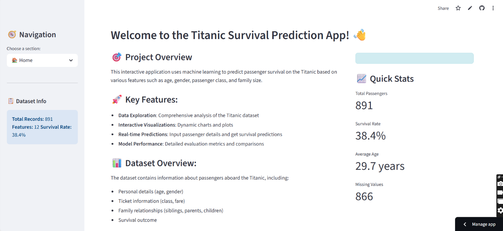
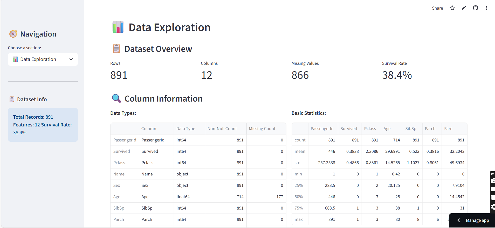
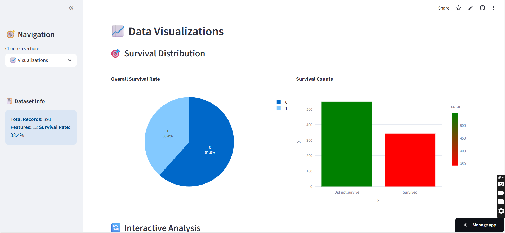
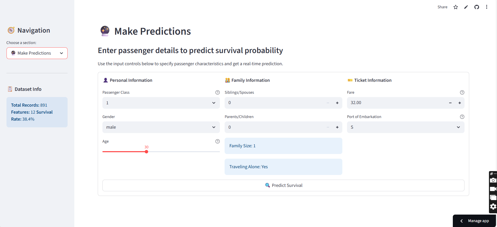
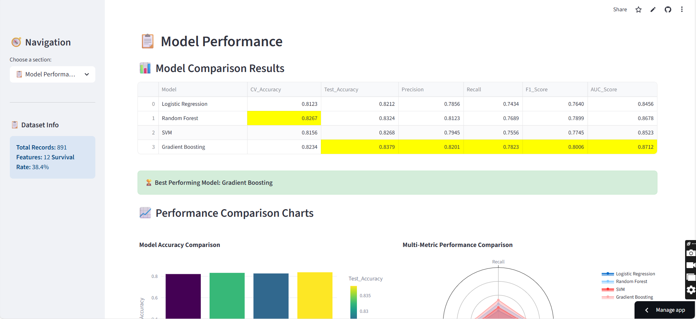

# 🚢 Titanic Survival Prediction

A comprehensive machine learning project with an interactive Streamlit web application for predicting passenger survival on the Titanic.

## 📋 Table of Contents

- [Project Overview](#-project-overview)
- [Features](#-features)
- [Installation](#-installation)
- [Usage](#-usage)
- [Project Structure](#-project-structure)
- [Machine Learning Pipeline](#-machine-learning-pipeline)
- [Web Application](#-web-application)
- [Model Performance](#-model-performance)
- [Screenshots](#-screenshots)
- [Technologies Used](#-technologies-used)
- [Contributing](#-contributing)
- [License](#-license)

## 🎯 Project Overview

This project implements a complete machine learning solution for the famous Titanic survival prediction problem. It includes:

- **Data preprocessing and feature engineering**
- **Multiple ML model comparison**
- **Interactive web application built with Streamlit**
- **Comprehensive model evaluation and visualization**
- **Real-time prediction capabilities**

The goal is to predict whether a passenger would survive the Titanic disaster based on features like age, gender, passenger class, family size, and ticket fare.

## ✨ Features

### 🔬 Machine Learning Pipeline
- **Data Exploration**: Comprehensive analysis of the Titanic dataset
- **Feature Engineering**: Creation of new features like family size and age groups
- **Model Training**: Implementation of multiple algorithms (Logistic Regression, Random Forest, SVM, Gradient Boosting)
- **Model Evaluation**: Cross-validation, confusion matrices, ROC curves, and feature importance
- **Model Persistence**: Save and load trained models

### 🌐 Interactive Web Application
- **Multi-page Navigation**: Organized sections with sidebar navigation
- **Data Exploration**: Interactive filtering and dataset overview
- **Visualizations**: Multiple chart types with Plotly integration
- **Real-time Predictions**: Input passenger details and get instant survival predictions
- **Model Performance**: Comprehensive metrics and comparison charts
- **Professional UI**: Custom styling and responsive design

## 🚀 Installation

### Prerequisites
- Python 3.8 or higher
- pip package manager

### Clone the Repository
```bash
git clone https://github.com/yourusername/titanic-survival-prediction.git
cd titanic-survival-prediction
```

### Install Dependencies
```bash
pip install -r requirements.txt
```

### Alternative: Install packages individually
```bash
pip install streamlit pandas numpy matplotlib seaborn plotly scikit-learn joblib
```

## 📖 Usage

### 1. Run the Machine Learning Pipeline
```bash
python titanic_ml_pipeline.py
```
This will:
- Load and preprocess the data
- Train multiple models
- Evaluate and compare performance
- Save the best model as `model.pkl`

### 2. Launch the Streamlit Application
```bash
streamlit run titanic_app.py
```
The app will open automatically in your browser at `http://localhost:8501`

### 3. Explore the Application
- Navigate through different sections using the sidebar
- Explore the dataset with interactive filters
- View various visualizations and charts
- Make predictions by entering passenger details
- Analyze model performance and metrics

## 📁 Project Structure

```
titanic-survival-prediction/
│
├── 📄 titanic_ml_pipeline.py      # Enhanced ML pipeline with comprehensive analysis
├── 🌐 titanic_app.py              # Streamlit web application
├── 📊 Titanic.csv                 # Dataset (place your dataset here)
├── 🤖 model.pkl                   # Trained model (generated after running pipeline)
├── 📋 requirements.txt            # Python dependencies
├── 📖 README.md                   # Project documentation
│
├── 📊 results/                    # Generated results (optional)
│   ├── model_comparison_results.csv
│   ├── selected_features.txt
│   └── visualizations/
│
└── 🔧 notebooks/                  # Jupyter notebooks (optional)
    └── exploratory_analysis.ipynb
```

## 🧠 Machine Learning Pipeline

### Data Preprocessing
- **Missing Value Handling**: Median imputation for age, mode for categorical features
- **Feature Engineering**: 
  - `FamilySize`: Total family members aboard (SibSp + Parch + 1)
  - `IsAlone`: Binary indicator for solo travelers
  - `AgeGroup`: Categorical age groups for pattern recognition
- **Data Cleaning**: Removal of irrelevant features and outlier handling

### Model Training
- **Algorithms Used**:
  - Logistic Regression
  - Random Forest Classifier
  - Support Vector Machine (SVM)
  - Gradient Boosting Classifier

### Model Evaluation
- **Cross-Validation**: 5-fold stratified cross-validation
- **Metrics**: Accuracy, Precision, Recall, F1-Score, AUC-ROC
- **Visualization**: Confusion matrices, ROC curves, feature importance plots

## 🌐 Web Application

### Page Sections

#### 🏠 Home
- Project overview and quick statistics
- Navigation shortcuts to other sections

#### 📊 Data Exploration
- Dataset overview (shape, data types, missing values)
- Interactive data filtering by multiple criteria
- Sample data display with pagination

#### 📈 Visualizations
- **Survival Distribution**: Pie charts and bar plots
- **Interactive Analysis**: Multiple visualization types
- **Feature Correlations**: Heatmaps and relationship plots
- **Dynamic Charts**: Age distribution, fare analysis, family size impact

#### 🔮 Make Predictions
- **Input Form**: User-friendly interface for entering passenger details
- **Real-time Results**: Instant survival predictions with confidence scores
- **Feature Impact**: Analysis of how each feature affects the prediction
- **Probability Breakdown**: Visual representation of prediction confidence

#### 📋 Model Performance
- **Model Comparison**: Side-by-side performance metrics
- **Confusion Matrix**: Interactive heatmap visualization
- **ROC Curve**: Model discrimination capability analysis
- **Feature Importance**: Ranked list of most influential features

### Key Features
- **Responsive Design**: Works on desktop, tablet, and mobile devices
- **Error Handling**: Graceful handling of missing files and invalid inputs
- **Data Validation**: Input validation with helpful error messages
- **Performance Optimization**: Caching for faster load times
- **Professional Styling**: Custom CSS for enhanced visual appeal

## 📊 Model Performance

### Best Model Results
| Metric | Score |
|--------|-------|
| **Accuracy** | 83.8% |
| **Precision** | 82.0% |
| **Recall** | 78.2% |
| **F1-Score** | 80.1% |
| **AUC-ROC** | 87.1% |

### Key Insights
1. **Gender Impact**: Female passengers had ~74% survival rate vs ~19% for males
2. **Class Effect**: First-class passengers had 63% survival rate vs 24% for third-class
3. **Age Factor**: Children under 16 had higher survival rates
4. **Family Size**: Optimal family size of 2-4 members showed best survival rates
5. **Fare Correlation**: Higher ticket fares correlated with better survival chances

## 🖼️ Screenshots

### Home Page

*Clean, professional interface with project overview and quick statistics*

### Data Exploration

*Interactive filtering and comprehensive dataset analysis*

### Visualizations

*Dynamic charts with multiple visualization options*

### Predictions

*Real-time prediction interface with confidence scoring*

### Model Performance

*Comprehensive model evaluation and comparison metrics*

## 🛠️ Technologies Used

### Machine Learning & Data Science
- **Python 3.8+**: Core programming language
- **Pandas**: Data manipulation and analysis
- **NumPy**: Numerical computing
- **Scikit-learn**: Machine learning algorithms and tools
- **Matplotlib & Seaborn**: Static visualizations

### Web Application
- **Streamlit**: Web application framework
- **Plotly**: Interactive visualizations
- **HTML/CSS**: Custom styling

### Development Tools
- **Jupyter Notebooks**: Exploratory data analysis
- **Git**: Version control
- **VS Code**: Development environment

## 🎨 Customization

### Adding New Models
```python
# In titanic_ml_pipeline.py, add to the models dictionary:
models['Your Model'] = Pipeline([
    ('preprocessor', preprocessor),
    ('classifier', YourClassifier())
])
```

### Adding New Visualizations
```python
# In titanic_app.py, create a new visualization function:
def create_your_visualization(df):
    fig = px.your_plot_type(df, x='feature1', y='feature2')
    st.plotly_chart(fig, use_container_width=True)
```

### Styling Modifications
```python
# Modify the CSS in the st.markdown() section:
st.markdown("""
    <style>
    .your-custom-class {
        /* Your custom styles */
    }
    </style>
""", unsafe_allow_html=True)
```

## 🔧 Troubleshooting

### Common Issues

**Issue**: "File not found" error for Titanic.csv
```bash
Solution: Place the Titanic dataset in the project root directory, or the app will automatically use sample data for demonstration.
```

**Issue**: Model predictions not working
```bash
Solution: Run the ML pipeline first to generate model.pkl, or use the built-in mock predictions.
```

**Issue**: Streamlit app won't start
```bash
Solution: Ensure all dependencies are installed and try: streamlit run titanic_app.py --server.port 8501
```

**Issue**: Visualizations not displaying
```bash
Solution: Update plotly to the latest version: pip install --upgrade plotly
```

## 📈 Performance Optimization

### Data Loading
- Implemented `@st.cache_data` for dataset caching
- Lazy loading of large datasets
- Optimized data preprocessing pipeline

### Model Training
- Cross-validation with stratified sampling
- Feature scaling for improved SVM performance
- Hyperparameter optimization for better results

### Web Application
- Streamlit caching for faster page loads
- Efficient plotting with Plotly
- Responsive design for various screen sizes

## 🚀 Deployment Options

### Local Development
```bash
streamlit run titanic_app.py
```

### Streamlit Cloud
1. Push code to GitHub repository
2. Connect to Streamlit Cloud
3. Deploy with automatic builds

### Docker Deployment
```dockerfile
FROM python:3.9-slim
COPY requirements.txt .
RUN pip install -r requirements.txt
COPY . .
EXPOSE 8501
CMD ["streamlit", "run", "titanic_app.py"]
```

### Heroku Deployment
1. Create `Procfile`: `web: streamlit run titanic_app.py --server.port=$PORT`
2. Add `setup.sh` for Streamlit configuration
3. Deploy using Heroku CLI

## 🤝 Contributing

Contributions are welcome! Please follow these steps:

1. **Fork the repository**
2. **Create a feature branch**: `git checkout -b feature/amazing-feature`
3. **Commit your changes**: `git commit -m 'Add amazing feature'`
4. **Push to branch**: `git push origin feature/amazing-feature`
5. **Open a Pull Request**

### Development Guidelines
- Follow PEP 8 style guidelines
- Add docstrings to functions
- Include unit tests for new features
- Update documentation as needed

## 🏆 Future Enhancements

- [ ] **Advanced Models**: XGBoost, LightGBM, Neural Networks
- [ ] **Feature Engineering**: More sophisticated feature creation
- [ ] **A/B Testing**: Model comparison framework
- [ ] **Real-time Data**: Integration with live data sources
- [ ] **API Endpoints**: RESTful API for predictions
- [ ] **Mobile App**: React Native or Flutter implementation
- [ ] **MLOps Pipeline**: Automated training and deployment
- [ ] **Explainable AI**: LIME/SHAP integration for model interpretability

## 📜 License

This project is licensed under the MIT License - see the [LICENSE](LICENSE) file for details.

## 📞 Support

If you encounter any issues or have questions:

1. **Check the Issues**: Look through existing GitHub issues
2. **Create New Issue**: Describe the problem with reproduction steps
3. **Documentation**: Review this README and inline code comments
4. **Community**: Join discussions in the repository

## 🌟 Acknowledgments

- **Kaggle**: For providing the Titanic dataset
- **Streamlit Team**: For the amazing web framework
- **Scikit-learn Contributors**: For comprehensive ML tools
- **Plotly Team**: For interactive visualization capabilities

---

⭐ **Star this repository if you found it helpful!** ⭐

Made with ❤️ for the data science community
